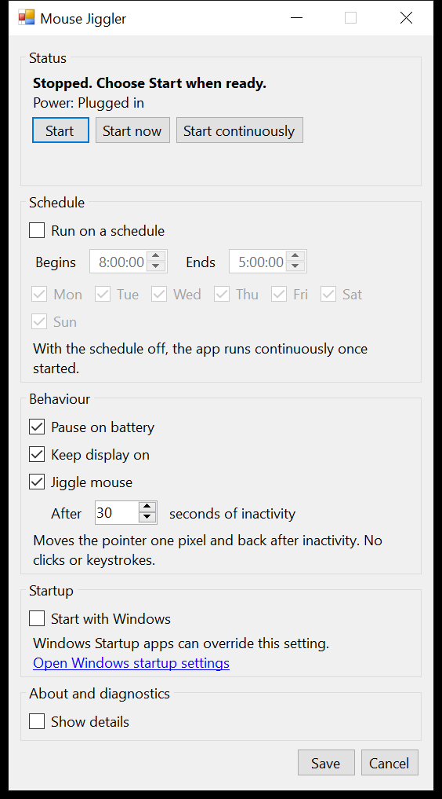

# Mouse Jiggler

A small Windows tray utility that keeps the computer awake and generates minimal mouse activity while you are away from the keyboard. It runs manually or on one daily schedule, can pause while on battery, and stays stopped until you explicitly start it again.

Windows 10 22H2 and Windows 11 build 22000 or later, x64 only. Open source under the MIT licence. No accounts, no telemetry, no network traffic.

## Status

Under active development against the [1.0 implementation epic](https://github.com/craigtrim/mouse-jiggler/issues/2). There is no released build yet. The issues in that epic are a plan, not a claim that the software is finished or tested.

The supported versions above are what the code targets and what the installer accepts. They are not all versions it has been run on. Everything executed so far ran on Windows 10 Pro 22H2 build 19045 x64: the automated suite, the packaging and lifecycle checks, the performance gates, and the acceptance rows that need no absent hardware. **Windows 11 has not been run at all**, and neither has a laptop, a second monitor, a screen reader or a second signed-in session. [docs/acceptance/v1.0.0.md](docs/acceptance/v1.0.0.md) lists what was executed and what was not, row by row.

## What it does

The app asks Windows to stay awake with `SetThreadExecutionState`, and optionally moves the pointer one physical pixel and back after a period of inactivity. It sends no clicks and no keystrokes. Both controls are requests to Windows rather than guarantees: with pointer movement switched off, Windows may still lock an idle session.

Start, Stop and the daily schedule live in the tray menu and in one Settings window. Stop persists across schedule boundaries, power changes, unlock, restart and sign-in. Saving a preference cannot start a stopped app.

The window above is captured from the real application by `scripts/capture-screenshot.ps1`, against a scratch settings folder so it shows first-run defaults rather than anyone's configuration. The same script captures the [running, scheduled, waiting and error states](docs/acceptance/v1.0.0.md#settings-window-states) for the acceptance record.

## What it deliberately does not do

Each of these was decided rather than overlooked, and the reason is short enough to give.

| Not included | Why |
| --- | --- |
| Timers and countdowns | A second way to express "until when" that has to agree with the schedule, and a second thing to persist |
| A global hotkey | It would need its own override model, and a keep-awake utility is not something you toggle mid-sentence |
| Several schedule windows, exceptions, profiles, holidays | One daily window covers the case this exists for; the rest is a calendar |
| A manual "I am plugged in" switch | Power is read from Windows. A setting that let you assert otherwise would only flatten a battery |
| Accounts, telemetry, adverts, update checks | There is no network code at all, and a test fails if any shipped assembly so much as names a networking type |
| Third-party runtime libraries | The application ships as three assemblies it owns, and nothing else |

It also does not run everywhere. ARM64 including x64 emulation, 32-bit Windows 10, Windows
Server and Windows in S mode are all out of scope, and the installer refuses them rather than
installing something that will not work. [docs/install.md](docs/install.md) has the full table.

Releases are **unsigned**. That is a deliberate decision for version 1 rather than an
oversight: SHA-256 checksums are published for every artifact, and Windows will still show a
reputation warning the first time you run the installer. Nothing here tries to talk you past
that warning.

## Building from source

You need Windows and the .NET SDK 8.0.130, which `global.json` pins with `rollForward` disabled. The app itself targets .NET Framework 4.8, which is already present on every supported version of Windows, so building requires the SDK but running the installed app does not.

    dotnet restore MouseJiggler.sln --locked-mode
    dotnet build MouseJiggler.sln -c Release --no-restore
    dotnet test MouseJiggler.sln -c Release --no-build --logger trx

Package versions are pinned centrally in `Directory.Packages.props` and locked in the committed `packages.lock.json` files. Every package is build-time or test-time only. Nothing third-party ships inside the application.

## Layout

| Project | Contains |
| --- | --- |
| `src/MouseJiggler.Core` | Rules and contracts. No Win32, no Windows Forms, no clock or registry access. |
| `src/MouseJiggler.Windows` | Win32 adapters and file storage. |
| `src/MouseJiggler.App` | Windows Forms composition, tray icon and Settings window. |
| `tests/MouseJiggler.Tests` | Unit and integration tests against fakes. |

Further detail is in [docs/architecture.md](docs/architecture.md), the decision record in [docs/decisions.md](docs/decisions.md), and the test policy in [docs/testing.md](docs/testing.md).

## Licence

MIT. See [LICENSE](LICENSE).
